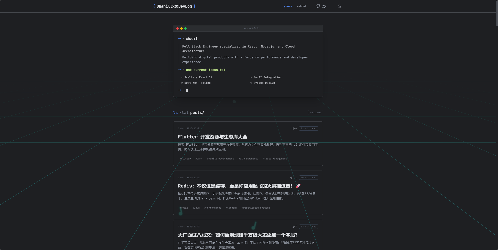
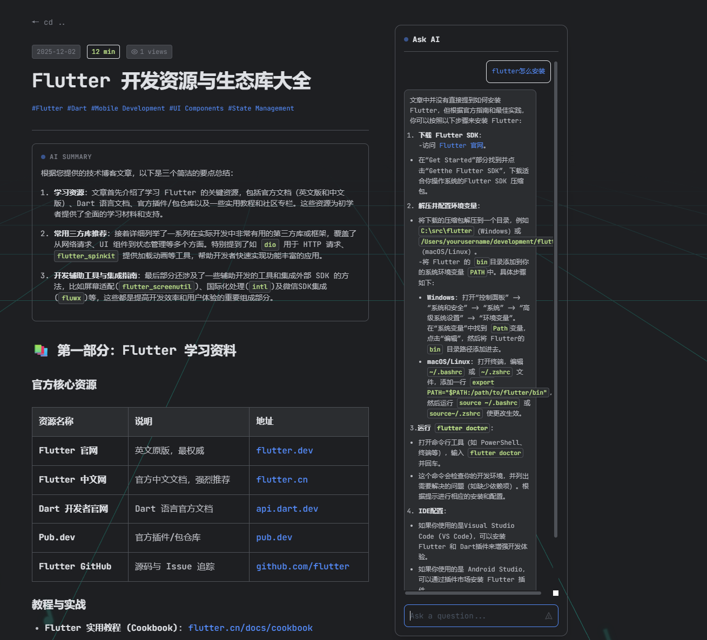
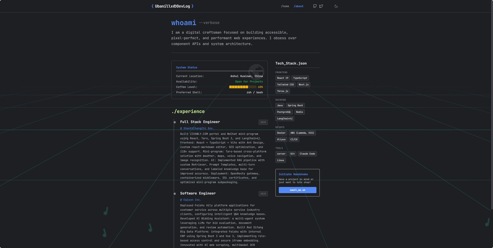
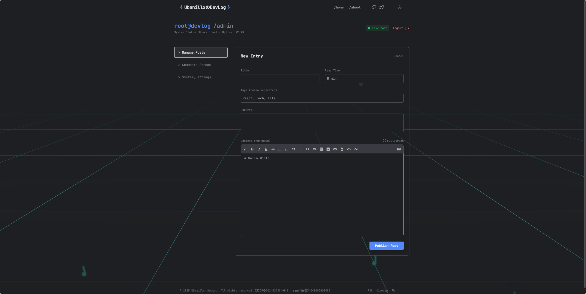
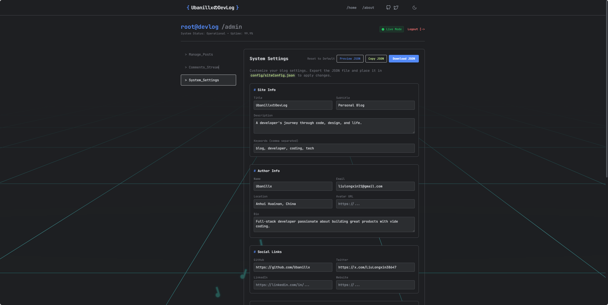

<h1 align="center">DevLog</h1>

<p align="center">
A modern, full-stack personal developer blog platform featuring terminal-style UI, AI-powered content summarization & Q&A, Markdown editing, and SEO optimization.
</p>

<p align="center">
一个现代化的全栈个人开发者博客平台，采用终端风格设计，支持 AI 内容总结与问答、Markdown 编辑、SEO 优化等功能。
</p>

<p align="center">


</p>

# Demo / 展示

### Homepage / 主页
Terminal-style homepage with `whoami` intro and post listing.

终端风格主页，展示作者介绍和文章列表。



### Article Page / 文章页面
Markdown rendering with AI-generated summary, tags, and reading time.

文章详情页，支持 Markdown 渲染、AI 摘要、标签和阅读时间。


### AI Chat & Summary / AI 对话与总结
Context-aware Q&A based on article content.

基于文章内容的智能问答，AI 根据文章回答用户问题。



### About Page / 个人页面
Developer profile with tech stack, experience timeline, and contact info.

开发者简介页，展示技术栈、工作经历和联系方式。



### Light Mode / 浅色模式
Full theme toggle support with preference memory.

支持深色/浅色主题切换，自动记忆用户偏好。


### Post Editor / 文章编辑
Markdown editor with toolbar, tag suggestions, and live preview.

后台文章编辑器，支持 Markdown 工具栏、标签建议和实时预览。



### System Settings / 系统设置
JSON-based site configuration for easy customization.

通过 JSON 配置站点信息和个人资料，无需修改代码。



## 🏗️ Architecture / 架构

```
devlog/
├── backend/    # Go + Gin + PostgreSQL
└── web/        # React + TypeScript + Vite
```

## 📖 Documentation / 文档

| Module | English | 中文 |
|--------|---------|------|
| **Backend** | [README](./backend/README.md) | [中文文档](./backend/README_ZH.md) |
| **Frontend** | [README](./web/README.md) | [中文文档](./web/README_ZH.md) |
| **API Reference** | [API.md](./backend/API.md) | - |
| **Database Setup** | [DATABASE_SETUP.md](./backend/DATABASE_SETUP.md) | - |
| **Docker Deploy** | [DOCKER.md](./DOCKER.md) | - |

## 🚀 Quick Start / 快速开始

### Option 1: Docker Compose (Recommended) / Docker 一键部署（推荐）

```bash
# Clone the repository / 克隆仓库
git clone https://github.com/your-username/devlog.git
cd devlog

# Start all services / 启动所有服务
docker compose up -d

# Access / 访问
# http://localhost
```

All services (PostgreSQL + Backend + Frontend) run on a single port (80), with nginx proxying API requests to the backend.

所有服务（数据库 + 后端 + 前端）统一通过 80 端口访问，nginx 自动代理 API 请求到后端。

#### Environment Variables / 环境变量配置

Create a `.env` file in the project root to customize settings:

在项目根目录创建 `.env` 文件以自定义配置：

```bash
# Database / 数据库
DB_USER=devlog
DB_PASSWORD=your_secure_password
DB_NAME=devlog

# JWT Secret / JWT 密钥
JWT_SECRET=your_jwt_secret_key

# AI Configuration (Optional) / AI 配置（可选）
AI_PROVIDER=dashscope
AI_API_KEY=your_ai_api_key
AI_MODEL=qwen-turbo

# OSS Configuration (Optional) / OSS 配置（可选）
OSS_ENDPOINT=oss-cn-hangzhou.aliyuncs.com
OSS_ACCESS_KEY_ID=your_access_key
OSS_ACCESS_KEY_SECRET=your_access_secret
OSS_BUCKET_NAME=your_bucket
OSS_BASE_URL=https://your_bucket.oss-cn-hangzhou.aliyuncs.com
```

#### Default Admin Account / 默认管理员账号

| Username | Password |
|----------|----------|
| `admin` | `root123456` |

To change the password before deployment / 部署前修改密码：

```bash
# 1. Generate password hash / 生成密码哈希
cd backend/cmd/genhash
go run main.go -password "your_new_password"

# 2. Copy the hash and replace in backend/schema.sql (line ~242)
# 复制生成的哈希值，替换 backend/schema.sql 中的 password_hash（约 242 行）
```

For more Docker deployment options, see [DOCKER.md](./DOCKER.md).

更多 Docker 部署选项请参阅 [DOCKER.md](./DOCKER.md)。

---

### Option 2: Manual Setup / 手动部署

#### Prerequisites / 环境要求
- Go 1.25+
- Node.js 18+
- PostgreSQL 12+

#### 1. Start Backend / 启动后端
```bash
cd backend
cp .env.example .env
# Edit .env with your config
go run main.go
```

#### 2. Start Frontend / 启动前端
```bash
cd web
cp .env.development.example .env.development
npm install
npm run dev
```

#### 3. Access / 访问
- **Frontend:** http://localhost:3000
- **Backend API:** http://localhost:8080/api/v1
- **Swagger Docs:** http://localhost:8080/swagger/index.html

## ✨ Features / 功能特性

### 🎨 UI & Theme / 界面与主题
- **Dark/Light Mode / 深色浅色模式** - Toggle with preference memory / 一键切换，自动记忆
- **Terminal Style / 终端风格** - Unique developer aesthetic / 独特的开发者美学

### 📝 Content Management / 内容管理
- **Markdown Editor / Markdown 编辑器** - Live preview with syntax highlighting / 实时预览，代码高亮
- **Tag System / 标签系统** - Flexible post categorization / 灵活的文章分类
- **Draft/Publish / 草稿发布** - Complete publishing workflow / 完整的发布工作流
- **File Upload / 文件上传** - Upload images to Alibaba Cloud OSS / 上传至阿里云 OSS

### 🤖 AI Features / AI 能力
- **AI Metadata / AI 元信息** - Auto-generate excerpt & tag suggestions / 自动生成摘要、标签建议
- **AI Summary / AI 总结** - One-click content summarization / 一键生成内容摘要
- **AI Q&A / AI 问答** - Context-aware Q&A based on post content / 基于文章的智能问答
- **Multi-Model / 多模型** - OpenAI / Gemini / Ollama / Qwen

### 💬 Interaction / 互动功能
- **Comments / 评论系统** - Public comments with admin replies / 访客评论，管理员回复
- **Moderation / 评论审核** - Soft delete & content management / 软删除与内容管理

### ⚙️ Configuration / 配置化
- **JSON Profile / JSON 配置** - Edit personal info via JSON, no code changes / 通过 JSON 配置个人信息
- **Environment Variables / 环境变量** - Flexible deployment config / 灵活的部署配置

### 🔧 DevOps / 开发运维
- **Docker Compose** - One-click deploy frontend + backend + database / 一键部署
- **SEO Tools / SEO 工具** - Auto URL push to Baidu/Bing / 自动推送 URL
- **RSS Feed / RSS 订阅** - Auto-generated RSS / 自动生成
- **Swagger Docs / API 文档** - Complete API documentation / 完整的接口文档

## 📄 License / 许可证

MIT License
